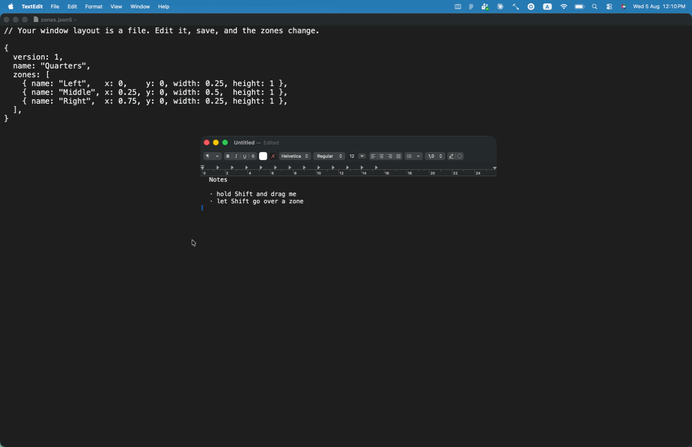

# Zonas

Zonas is a macOS menu bar utility that snaps windows into zones you define
yourself: hold **⇧ Shift** while dragging a window, the zones light up, drop it
and the window fills the one under the cursor. It is for people who liked
[FancyZones](https://learn.microsoft.com/en-us/windows/powertoys/fancyzones)
from PowerToys on Windows and want the same gesture on a Mac. (*zonas* is
Spanish for *zones*.)

<!--
  DEMO GIF GOES HERE.
  Record a window being dragged with Shift held down: the zones appearing,
  the one under the cursor highlighting, the window snapping on release.
  Then replace this comment with:
  
-->

**Status: prototype.** The whole path works end to end — detecting the drag,
previewing the zones, moving the window — but zones are still edited by hand in
a JSON file. There is no visual editor yet, and that is the main thing standing
between this and something you would recommend to someone else.

## Requirements

- macOS 14 (Sonoma) or later.
- Xcode 16 or the matching Command Line Tools — the package declares
  `swift-tools-version: 6.0` and builds in Swift 5 language mode.
- The **Accessibility** permission. It is not optional: without it the app
  cannot move other applications' windows and fails silently.
- Recommended before your first build: a self-signed code signing certificate.
  See [Development signing](#development-signing) — skipping it is the single
  most common way to lose an afternoon on this project.

## Build

```bash
git clone https://github.com/pablocaviglia-uy/zonas.git
cd zonas
./build.sh -r
```

`build.sh` compiles with SwiftPM and wraps the result in a real `.app` bundle,
because macOS will not grant the Accessibility permission to a bare executable:
it needs an `Info.plist` and a signature.

| Command | What it does |
|---|---|
| `./build.sh` | Debug build, leaves `Zonas.app` under `.build/` |
| `./build.sh release` | Same, optimized |
| `./build.sh -r` | Release build, installs into `/Applications` and opens it |
| `./build.sh debug -r` | Forces a debug build and installs it anyway |

The split default is deliberate: what you build to look at can be debug, but
what gets copied into `/Applications` and then hangs off your mouse all day
long is built optimized unless you ask otherwise.

Two things only work from the installed copy: **Launch at Login** (greyed out
in the `.build/` copy on purpose) and a stable Accessibility grant.

## Using it

Hold **⇧ Shift** while dragging a window. The zones appear; drop the window on
the one you want.

Shift was chosen because Option is already taken by the native macOS tiling,
and stepping on it would make the two features fight each other.

The menu bar item — a `rectangle.split.3x1` glyph, dimmed while the permission
is missing — has:

| Item | |
|---|---|
| `Hold ⇧ while dragging a window` | Reminder, not a button |
| `Edit Zones (JSON)…` | Opens `layout.json` in your default editor |
| `Reload Zones` (⌘R) | Re-reads the file after you edit it |
| `Open Log…` | Opens `~/Library/Logs/Zonas.log` |
| `Launch at Login` | Only available from `/Applications` |
| `Accessibility Permissions…` | Prompts and opens the Settings pane |
| `Quit Zonas` (⌘Q) | |

There is no permission prompt at launch, on purpose: when the app starts by
itself at login, a modal system dialog either steals focus or ends up buried
behind the Desktop. Asking is what the `Accessibility Permissions…` item is
for — the moment the user actually asked.

When something looks wrong, the log is the place to look:

```bash
tail -f ~/Library/Logs/Zonas.log
```

It records **state transitions**, not every event — a `mouseDragged` arrives
dozens of times per second and would bury the file in noise.

## The zones

Zones live in `~/Library/Application Support/Zonas/layout.json`, stored as
fractions from 0 to 1 of the screen's usable area — the part left over after
the menu bar, the Dock and, on the machines that have one, the notch. Keeping
them relative instead of in pixels is what makes the same layout work on the
laptop screen and on an external monitor without redrawing it.

```json
{
  "name": "Three Columns",
  "zones": [
    { "name": "Left",   "x": 0,    "y": 0, "width": 0.25, "height": 1 },
    { "name": "Center", "x": 0.25, "y": 0, "width": 0.5,  "height": 1 },
    { "name": "Right",  "x": 0.75, "y": 0, "width": 0.25, "height": 1 }
  ]
}
```

Edit the file and pick **Reload Zones** from the menu bar. Notes:

- The file is written once, on first launch, and **never overwritten** after
  that. Your zones are yours.
- The `id` field is optional — leave it out and one is made up at load time.
- If the JSON does not parse, the app says so in the log, leaves your file
  exactly as it is and falls back to the built-in three-column layout. It will
  not silently eat your edits.
- When zones overlap, **the smallest one containing the cursor wins**. That is
  what makes a layout with one big background zone and smaller ones on top of
  it usable.

## Development signing

**Do this before your first build.** Without your own certificate, the
Accessibility permission breaks on *every* recompile, and the symptom is one of
those that costs you an afternoon: the switch stays on in System Settings and
the app still behaves as if it had been denied.

### Why it breaks

The permission is not granted to "the app". It is granted to a **signature**.

Next to the on/off switch, TCC — the subsystem behind Privacy & Security —
stores the *code requirement* that the app satisfied at the moment you granted
it. From then on, every time the app asks `AXIsProcessTrusted()`, the system
does not check "is this app in the list?" but "does the code asking still
satisfy the requirement I recorded?".

With an ad-hoc signature there is no certificate to name, so the designated
requirement macOS derives is `cdhash H"..."` — the hash of the binary's code
directory. And `swift build` produces a different binary on every run, even
from identical sources at the same path. So the recorded requirement pins the
one exact build that was running when you clicked the switch, and the next
build can never satisfy it again.

The result is the most disorienting failure mode in this project: the switch is
still on in Settings, but `AXIsProcessTrusted()` returns `false` forever,
because whoever is asking is no longer the code that was said yes to. In the
system log it shows up as:

```
tccd: Failed to match existing code requirement
```

With your own certificate, the designated requirement names the
**certificate** instead of the binary's hash — and the certificate does not
change between builds. Any build you sign with it satisfies a grant made to any
earlier build.

### Creating the certificate

1. **Keychain Access** → menu *Certificate Assistant* → *Create a Certificate…*
   - Name: `Zonas Dev`
   - Identity Type: **Self Signed Root**
   - Certificate Type: **Code Signing**
   - Tick *Let me override defaults* and set the validity to **3650 days** —
     the 365-day default breaks the permission once a year, and by then nobody
     remembers why.
   - Keychain: **login**
2. Double-click the certificate → expand **Trust** → *Code Signing* → **Always
   Trust**. Authenticate when asked.
   **This step is not optional:** without it `codesign` answers
   `no identity found` and you are back to ad-hoc.
3. Check that it shows up:
   ```bash
   security find-identity -v -p codesigning
   ```
4. Export a `.p12` backup **outside the repository**. Losing the certificate
   breaks the permission exactly the same way as never having had one.
5. Build. `build.sh` finds the identity on its own — it looks for `Zonas Dev`,
   `Apple Development` or `Developer ID Application`, in that order. To force a
   specific one:
   ```bash
   ZONAS_SIGN_ID="My Certificate" ./build.sh
   ```
   After the first signed build you have to re-grant the permission **once**
   (see below), because the grant you already had pointed at the old cdhash.

Two details `build.sh` takes care of, both of which exist to keep the
permission from breaking again later:

- It signs with `--timestamp`, a secure timestamp, not `--timestamp=none`.
  Without it, the day the certificate expires the signature stops validating
  and the permission breaks again for no visible reason. With it, the signature
  keeps validating past expiry, because there is proof it was made while the
  certificate was still valid.
- After every build it prints the resulting designated requirement, on a line
  starting with `requisito:` — the same thing you would get from
  `codesign -d -r- /Applications/Zonas.app`. That single line is the thing to
  watch. Signed with a certificate it names the certificate and stays identical
  build after build; if it ever changes, TCC will reject the app no matter what
  the switch says.

Zonas also writes its own signature fingerprint — the live process's cdhash and
designated requirement — into the log at startup, which closes the diagnosis at
a glance: if today's cdhash is not the one from the previous run, the permission
is already broken and there is nothing else to investigate.

### Without a certificate

If no stable identity is found, `build.sh` still signs ad-hoc, but pins the
designated requirement by hand:

```bash
codesign --force --timestamp=none --sign - \
  --identifier "uy.com.fcstudio.zonas" \
  -r="designated => identifier \"uy.com.fcstudio.zonas\"" \
  Zonas.app
```

This works most of the time, but it is a patch and nothing more. The
requirement it leaves behind is weak — any app declaring the same bundle
identifier satisfies it — and Apple makes no promise that TCC will honor it
instead of falling back to the cdhash. Fine for a development machine. Never
for anything you hand to someone else.

### When the permission "gets lost"

Toggling the switch off and back on **does not work**. It rewrites the boolean
and keeps the old, stale code requirement. The entry has to be deleted and
created again:

1. Quit Zonas.
2. In System Settings → Privacy & Security → Accessibility, select Zonas and
   remove it with the **−** button.
3. Add it back with **+**, picking `/Applications/Zonas.app`, and leave it
   switched on.

To confirm the diagnosis before touching anything (`log` is a zsh builtin, so
the absolute path is required):

```bash
/usr/bin/log show --last 30m --predicate 'subsystem == "com.apple.TCC"' --info --debug \
  | grep -i zonas | grep -E "Failed to match|cdhash H|TCCDEvent"
```

## How it is put together

| File | What it solves |
|---|---|
| `DragMonitor.swift` | Detects the drag with a listen-only event tap. The awkward part: macOS has no API that tells you a window is being moved. |
| `AXWindow.swift` | Reads and moves other apps' windows through the Accessibility API. |
| `Coords.swift` | Converts between the two macOS coordinate systems — Cocoa's bottom-left origin and CoreGraphics' top-left one. The number one source of multi-monitor bugs. |
| `OverlayController.swift` | The click-through translucent layer that draws the zones. |
| `Zone.swift` | The model and its JSON persistence. |
| `AppDelegate.swift` | Menu bar, permission watchdog, wiring. |
| `LaunchAtLogin.swift` | The login item, via `SMAppService`. |
| `Log.swift` | Append-only file logging. |

## Not there yet

- [ ] Visual zone editor
- [ ] Multiple layouts and a way to switch between them
- [ ] Respecting the minimum window size each app enforces
- [ ] Testing against Electron, Java and other apps that do not cooperate with the Accessibility API
- [ ] Preferences: choosing the modifier key, gaps between zones
- [ ] Signing and notarization so it can actually be distributed

## License

MIT. See [LICENSE](LICENSE).
